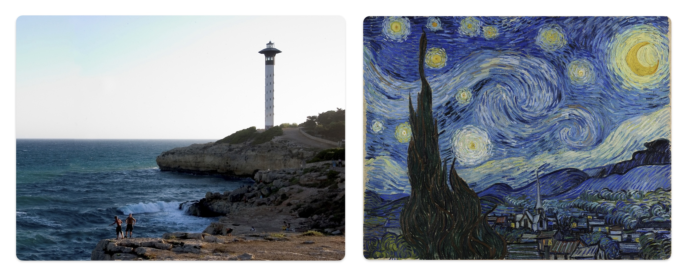
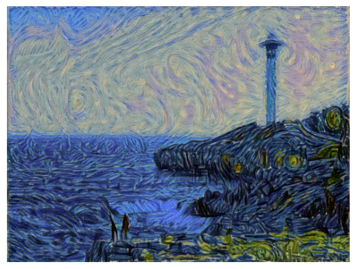
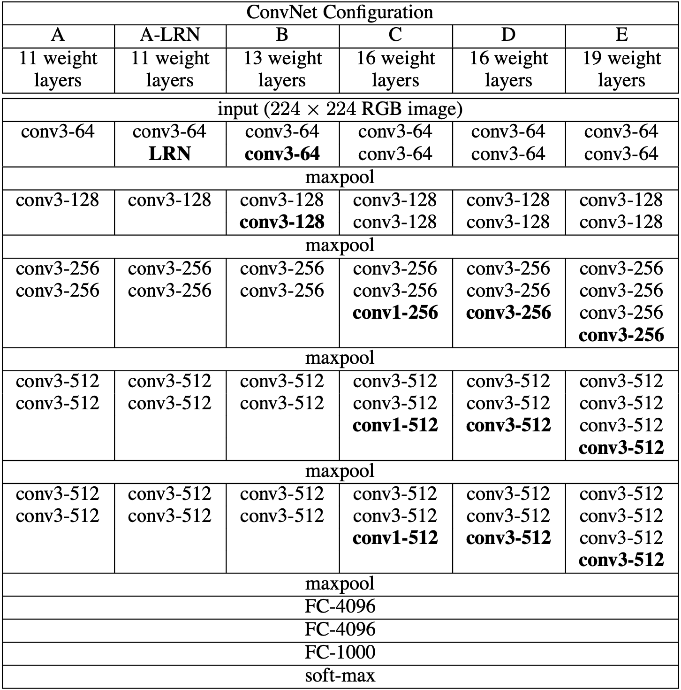

# Neural-Style-Transfer-amb-VGG19
Aquest projecte consisteix en utilitzar un model VGG19 per a la transferència d'estil entre imatges. A més, intento explicar de manera entenedora conceptes com la ***Matriu Gram*** i l'optimitzador ***L-BFGS***.

El codi del projecte el trobeu al notebook [styleTransfer](styleTransfer.ipynb).

## Taula de continguts
* [Introducció](#Introducció)
* [Estructura de VGG19](#1-estructura-de-vgg19)
* [Transferència de l'estil](#2-transferència-de-lestil)
* [*Gram Matrix*](#3-gram-matrix)
  * [Perquè utilitzem la *Gram Matrix*?](#31-perquè-utilitzem-la-gram-matrix)
* [Funció de pèrdues](#4-funció-de-pèrdues)
  * [*Loss* de contingut](#41-loss-de-contingut)
  * [*Loss* d'estil](#42-loss-destil)  
  * [Respecte quines capes optimitzem?](#43-respecte-quines-capes-optimitzem)
* [Optimització](#5-optimització)
  * [*L-BFGS*](#51-l-bfgs)
* [Documentació](#6-documentació)
___

# Introducció

VGG19 és un model de **xarxa neuronal convolucional** (CNN) desenvolupat per l'equip de Visual Geometry Group de la Universitat d'Oxford i es va presentar al concurs **ILSVRC** ( *ImageNet Large Scale Visual Recognition Challenge* ) de 2014. Aquest model es va endur el 2n premi per darrere de GoogLeNet.<br><br>El model ha mostrat molt bons resultats quan s'entrena amb milions d'imatges del dataset **ImageNet**. És molt utilitzat en tasques de visió per computador, com la detecció i classificació d'objectes i la **transferència d'estil**.<br><br>La transferència d'estil és una tècnica que combina l'estil visual d'una imatge amb el contingut d'una altra imatge, creant una imatge resultant que manté el contingut original però amb l'aspecte estètic de la imatge d'estil. A continuació teniu una demostració del que s'ha aconseguit amb aquest projecte:<br>

<p align="center">
  
</p> 
<p align="center">
  
</p>

***fig 1***: *Mostra de transferència d'estil amb el model que s'explica en aquest repositori. En aquest cas la imatge de contingut es la del far i se li ha aplicat l'estil del quadre "La nit estrellada" de Van Gogh.*<br><br>

## 1. Estructura de VGG19

El model pren aquest nom per la seva arquitectura profunda de 19 capes (**16** capes **convolucionals**, **3** capes ***fully-connected***, capes de ***max-pooling*** i funció d'activació **ReLU**). Les capes convolucionals es troben agrupades en 5 blocs convolucionals ( ***fig 2***: *la columna E es correspon amb VGG19* ).<br><br>Per al nostre projecte només necessitarem l'etapa d'**extracció de característiques**. Per tant, no hi afegirem les últimes 5 capes (*maxpool*, 3x *fully-connected*, *maxpool*).<br><br>Carregarem un conjunt de parametres (***weights***) preentrenats amb el dataset *ImageNet*. A més, congelarem totes les capes per tal d'assegurar-nos que no canviem cap d'aquest paràmetres ja entrenats.<br><br>

<p align="center">
  
</p>

***fig 2***: *Taula comparativa d'arquitectures de CNNs extreta del paper 'Very Deep Convolutional Networks for Large-Scale Image Recognition' (https://doi.org/10.48550/arXiv.1409.1556)* <br><br>

## 2. Transferència de l'estil

Podem utilitzar VGG19 per extreure característiques que ens permetin representar tant l'estil com el contingut d'una imatge: les **capes inicials** de la xarxa capturen detalls d'estil com **textures i colors**, mentre que les **capes més profundes** codifiquen informació de contingut, com ara **objectes i escenes**.<br><br>La idea és crear una imatge que anomenem ***target*** que sigui una combinació de dues. Podem iniciar la nova imatge com una copia de la imatge contingut. En el procés de transferència d'estil, **minimitzem les diferències** entre les representacions d'estil de la **imatge *target* i la imatge d'estil**, així com entre les representacions de contingut de la **imatge *target* i l'imatge de contingut**. Aixo ho aconseguim ajustant iterativament la imatge *target* mitjançant ***backprop***. A diferència del que es fa en l'entrament de xarxes neuronals, el *backprop* el realitzem per **modificar el input** (imatge *target*) enlloc dels pesos (*weights*). D'aquesta manera creem una nova imatge que manté el contingut original però pren l'estil de l'altre imatge.<br><br>
___
## 3. *Gram Matrix*

En els models de transferència d'estil s'acostuma a utilitzar una operació matricial que té com a resultat una matriu que s'anomena ***Matriu Gram***.<br><br>Per exemple, si partim d'un conjunt de vectors (diguem $F$) i la seva transposada ($F^T$), la *Matriu Gram* de $F$ seria la multiplicació matricial d'aquestes dues:<br><br>$G = F \times F^T$<br><br>Aquesta matriu resultant codifica l'autocorrelació del conjunt de vectors $F$. És a dir, és una representació de la **correlació que existeix entre els diferents vectors** del conjunt. Això és degut a que cada element de $G$ és el producte escalar de dos vectors de $F$:<br><br>$G_{ij} = F_i \cdot F_j$

### 3.1 Perquè utilitzem la *Gram Matrix*?

Utilitzem aquesta matriu per obtenir una **representació de l'estil i contingut** de cada imatge. Per entendre millor, però, la utilitat d'aquesta representació, cal entendre com l'apliquem en el nostre projecte.<br><br>En el context de transferència d'estil, volem calcular una *Matriu Gram* per algunes capes del model (**una matriu per cadascuna** de les capes seleccionades). Cal recordar que diferents capes captaràn característiques diferents de la imatge: capes **inicials** representeràn **detalls petits** i capes més **profundes** captaràn **característiques més generals**. Per tant, el que farem serà trobar correlacions entre detalls petits de la imatge (**estil**) i també correlacions entre característiques generals (**contingut**).<br><br>El conjunt de vectors que anteriorment hem anomenat $F$ seria el conjunt de mapes de característiques  que genera **una sola capa** del model VGG19. Per calcular una de les Matrius Gram ho fariem de la següent manera:<br>
_$F=(D, H, W)$ on: $D$ = numero de filtres, $(H)$ = alçada del mapa de característiques i $(W)$ = amplada del mapa de característiques._
* $F_n$ seria el mapa de característiques resultant del *n-éssim* filtre d'una capa convolucional.
* Cada mapa de característiques $F_n$ es transforma en un conjunt de vectors (*matriu*) de dimensions $(D, H \times W)$. Podem dir que en aquest procés *estirem* els mapes de característiques generats per cada filtre perque prenguin forma de vector (de tamany $H \times W$).
* A partir d'aquesta matriu $F_n$ calculem la corresponent *Matriu Gram*: $G_n = F_n \times F_n^T$

Si simplifiquem conceptualment el significat dels mapes de característiques podem explicar com extraiem un representació de l'estil a partir d'aquests:<br><br> *Podem entendre que cada filtre d'una capa s'encarrega de detectar diferents característiques. Per exemple, un filtre pot estar buscant linies diagonals i un altre pot estar buscant zones de color vermell. Els seus respectius mapes de característiques prendran valors alts en les zones on hi hagi linies diagonals i, per l'altre filtre, valors alts en zones on hi hagi color vermell. En el nostre exemple bàsic podriem buscar, mitjançant una **Matriu Gram**, una correlació entre aquests dos mapes. És a dir, podriem trobar si les zones amb liníes diagonals acostumen a ser de color vermell. Aquesta relació de característiques és el que visualment entenem com estil.*
<br>L'anterior exemple redueix molt la complexitat real del funcionament de les CNNs però ens serveix com a métode d'explicació. Els filtres realment no busquen linies o colors, sinó que ***aprenen*, mitjançant *backprop***, filtres que codifiquen la informació de la imatge en una altra dimensionalitat.<br><br>Per resumir, la correlació entre mapes de característiques ens ajuda a comprendre com les textures, colors i patrons es repeteixen o varien dins de la imatge. Així és com definim l'estil visual.

___
## 4. Funció de pèrdues

Una funció de pèrdues (***Loss Function***) mesura l'eficàcia d'un model, on resultats alts indiquen baixa precisió. En la tasca de transferència d'estil, obtindrem un valor molt alt si: les representacions d'estil (de la imatge estil i target) són molt diferents, les representacions de contingut (de la imatge contingut i target) són molt diferents, o una combinació de les dues coses.<br><br>En el procés d'entrenament de xarxes neurals, com VGG19, s'utilitza el *backprop* per ajustar els pesos (*weights*) i optimitzar la funció de pèrdues, millorant així el model. En transferència d'estil, en canvi, el *backprop* s'utilitza per **ajustar l'imatge *target***, modificant-la per optimitzar la funció de pèrdues i aconseguir l'estil desitjat. <br><br>La funció que utilitzem realment està formada per una suma ponderada de dues altres. Per mesurar la ***loss total*** ($L_{total}$) del nostre model ho fem amb la següent formula:

$L_{total} = W_{content} \times L_{content} \ + \ W_{style} \times L_{style} $

on $W$ són pesos que ens permeten ajustar en quina mesura volem aplicar l'estil i contingut a la nova imatge.

### 4.1 Respecte quines capes optimitzem? 

Podem ajustar a quines capes donem més importància a la hora de transferir l'estil assignant pesos a cadascuna d'aquestes:
```python
style_weights = {'conv1_1': 1.,
                 'conv2_1': 0.75,
                 'conv3_1': 0.2,
                 'conv4_1': 0.2,
                 'conv5_1': 0.2
                 }
content_layer = 'conv4_2'
```
Les capes més superficials, com 'conv1_1' o 'conv2_1', són responsables de capturar textures i patrons simples, per aquest motiu els assignem un pes més alt en la pèrdua d'estil. A mesura que avancem a capes més profundes, com 'conv4_2', seleccionada per a la pèrdua de contingut, aquestes capten característiques més abstractes i la estructura global de l'imatge. La combinació ponderada d'aquestes capes en l'optimització ens permet crear una imatge final que manté el contingut original i que incorpora l'estil de l'imatge de referència.<br>
Per fer el codi més entenedor s'ha assignat noms a les capes amb les que treballarem:
```python
layers = {
            '0': 'conv1_1',
            '5': 'conv2_1',
            '10': 'conv3_1',
            '19': 'conv4_1',
            '21': 'conv4_2',  # representació contingut
            '28': 'conv5_1'
        }
```
La nomenclatura de les capes és: **conv[*numero capa*]_[*numero filtre*]**. Podem consultar les capes del nostre model fent:

```python
print(vgg19)
```
```
Sequential(
  (0): Conv2d(3, 64, kernel_size=(3, 3), stride=(1, 1), padding=(1, 1))
  (1): ReLU(inplace=True)
  (2): Conv2d(64, 64, kernel_size=(3, 3), stride=(1, 1), padding=(1, 1))
  (3): ReLU(inplace=True)
  (4): MaxPool2d(kernel_size=2, stride=2, padding=0, dilation=1, ceil_mode=False)
  (5): Conv2d(64, 128, kernel_size=(3, 3), stride=(1, 1), padding=(1, 1))
  (6): ReLU(inplace=True)
  (7): Conv2d(128, 128, kernel_size=(3, 3), stride=(1, 1), padding=(1, 1))
  (8): ReLU(inplace=True)
  (9): MaxPool2d(kernel_size=2, stride=2, padding=0, dilation=1, ceil_mode=False)
  (10): Conv2d(128, 256, kernel_size=(3, 3), stride=(1, 1), padding=(1, 1))
  (11): ReLU(inplace=True)
  (12): Conv2d(256, 256, kernel_size=(3, 3), stride=(1, 1), padding=(1, 1))
  (13): ReLU(inplace=True)
  (14): Conv2d(256, 256, kernel_size=(3, 3), stride=(1, 1), padding=(1, 1))
  (15): ReLU(inplace=True)
  (16): Conv2d(256, 256, kernel_size=(3, 3), stride=(1, 1), padding=(1, 1))
  (17): ReLU(inplace=True)
  (18): MaxPool2d(kernel_size=2, stride=2, padding=0, dilation=1, ceil_mode=False)
  (19): Conv2d(256, 512, kernel_size=(3, 3), stride=(1, 1), padding=(1, 1))
  (20): ReLU(inplace=True)
  (21): Conv2d(512, 512, kernel_size=(3, 3), stride=(1, 1), padding=(1, 1))
  (22): ReLU(inplace=True)
  (23): Conv2d(512, 512, kernel_size=(3, 3), stride=(1, 1), padding=(1, 1))
  (24): ReLU(inplace=True)
  (25): Conv2d(512, 512, kernel_size=(3, 3), stride=(1, 1), padding=(1, 1))
  (26): ReLU(inplace=True)
  (27): MaxPool2d(kernel_size=2, stride=2, padding=0, dilation=1, ceil_mode=False)
  (28): Conv2d(512, 512, kernel_size=(3, 3), stride=(1, 1), padding=(1, 1))
  (29): ReLU(inplace=True)
  (30): Conv2d(512, 512, kernel_size=(3, 3), stride=(1, 1), padding=(1, 1))
  (31): ReLU(inplace=True)
  (32): Conv2d(512, 512, kernel_size=(3, 3), stride=(1, 1), padding=(1, 1))
  (33): ReLU(inplace=True)
  (34): Conv2d(512, 512, kernel_size=(3, 3), stride=(1, 1), padding=(1, 1))
  (35): ReLU(inplace=True)
  (36): MaxPool2d(kernel_size=2, stride=2, padding=0, dilation=1, ceil_mode=False)
)
```


### 4.2 *Loss* de contingut $L_{content}$

La loss de contingut és una mesura de com de diferent és la imatge target respecte a la imatge de contingut original a partir de les característiques bàsiques extretes per la xarxa neuronal. Utilitzem aquesta pèrdua per assegurar que la imatge resultant mantingui l'estructura essencial de la imatge original de contingut mentre adopta l'estil de l'imatge de referència.<br><br>El càlcul d'aquesta pèrdua es realitza a partir de les característiques extretes per una capa específica de la xarxa, generalment una capa profunda que captura informació d'alt nivell sobre la imatge (en aquest cas, 'conv4_2'). Aquesta capa ha demostrat ser eficaç per mantenir la 'informació de contingut' de la imatge, que inclou la distribució general d'objectes i les seves formes.<br><br>Utilitzem el MSE per extreure l'error entre la representació de contingut original i la de la imatge target:

```python
content_loss = torch.mean((target_features[content_layer] - content_features[content_layer]) ** 2)
```


### 4.3 *Loss* d'estil $L_{style}$

La loss d'estil mesura la diferència entre les textures, els colors i els patrons generals (l'estil) de la imatge target comparada amb l'estil de la imatge de referència. Per calcular aquesta pèrdua, primer generem les Matrius Gram de les característiques d'estil de l'imatge de referència per a cada capa convolucional seleccionada:

```python
for layer in style_weights:
    style_grams[layer] = gram_matrix(style_features[layer])
```

Una vegada generades, comparem aquestes matrius amb les Matrius Gram de la imatge target per a les mateixes capes. La pèrdua per cada capa es calcula realitzant el MSE entre les dues matrius Gram, ponderada pel pes assignat a cada capa. Això permet tenir en compte de manera diferencial l'impacte visual de l'estil en diferents nivells de detall i complexitat que cada capa representa:

```python
for layer in style_weights:
        
  target_feature = target_features[layer]
  target_gram = gram_matrix(target_feature)      
  layer_style_loss = style_weights[layer] * torch.mean((target_gram - style_grams[layer]) ** 2)
  style_loss += layer_style_loss / (target_feature.shape[1] * target_feature.shape[2] * target_feature.shape[3])
```
___
### 5. Optimització

En la transferència d'estil, la fase d'optimització és crucial per ajustar l'imatge *target* de manera que correspongui amb les nostres expectatives d'estil i contingut. Això s'aconsegueix mitjançant un procés iteratiu que modifica la imatge *target* per minimitzar la funció de pèrdues, que inclou tant la pèrdua d'estil com la de contingut. L'optimitzador que triem per a aquesta tasca té un impacte significatiu en la velocitat i l'eficàcia amb la qual es realitzen aquestes modificacions.

### 5.1 *L-BFGS*

*L-BFGS* (Limited-memory Broyden–Fletcher–Goldfarb–Shanno) és un algoritme d'optimització que s'acostuma a utilitzar bé en problemes de gran dimensió com la transferència d'estil, on es manipulen milers o fins i tot milions de paràmetres (píxels) de la imatge *target*. Aquest algoritme és una variant de *BFGS* que utilitza una quantitat limitada de memòria, cosa que el fa més adequat per a problemes amb una gran quantitat de variables.

#### Funcionament de *L-BFGS*

L-BFGS és un mètode d'optimització quasi-Newtonià que aproxima la matriu Hessiana (la matriu de segones derivades) del problema d'optimització per estimar la direcció en què els paràmetres (en aquest cas, píxels de la imatge target) haurien de ser ajustats per minimitzar la funció de pèrdues.<br><br>A diferència del mètode complet BFGS, que emmagatzema tota la matriu Hessiana (que pot ser extremadament gran), L-BFGS manté només una representació limitada basada en uns quants vectors que capturen les actualitzacions més recents de les diferències de gradients i de posicions.<br><br>En lloc de calcular directament la matriu Hessiana a partir dels gradients, L-BFGS utilitza aquesta informació limitada per reconstruir una aproximació del invers del Hessià. Aquesta estratègia redueix significativament el cost computacional, encara que implica una certa pèrdua de precisió en l'aproximació. El nombre de vectors emmagatzemats (més gradients i diferències de posició) pot ser ajustat per equilibrar la precisió de l'aproximació amb el consum de memòria i el rendiment computacional.<br><br>El process es el següent:<br>
- **Inicialització:** L-BFGS comença amb una aproximació inicial de la matriu Hessiana inversa per simplificar els càlculs inicials.
- **Recopilació de Dades:** En cada iteració, l'algoritme guarda una quantitat limitada de les últimes actualitzacions dels gradients i les diferències de posicions dels paràmetres (diferències entre vectors consecutius de paràmetres i gradients). Aquestes dades són els "vectors de correcció".
- **Aproximació del Hessià Invers:** Utilitzant els vectors de correcció recollits, el optimitzador *L-BFGS* ajusta l'aproximació actual de la inversa de la matriu Hessiana. Aquest procés utilitza els vectors de correcció per modificar l'estimació de la matriu Hessiana inversa, sense necessitat de reconstruir o emmagatzemar la matriu completa.
- **Actualització dels Paràmetres:** L'algoritme utilitza aquesta aproximació per calcular la direcció òptima en la qual els paràmetres haurien de ser ajustats. Aquesta direcció s'obté multiplicant el gradient actual de la funció de pèrdua per l'aproximació de la Hessiana inversa.
- **Iteració:** Els passos es repeteixen amb cada iteració, utilitzant les noves informacions de gradient i actualitzacions de paràmetres per refinar l'aproximació de matriu Hessiana inversa.

#### Aplicació en la transferència d'estil

Durant la transferència d'estil, inicialitzem l'imatge *target* com una còpia de la imatge de contingut. En cada iteració, *L-BFGS* calcula el gradient de la funció de pèrdues respecte a la imatge *target* i actualitza la imatge per minimitzar aquesta pèrdua.

___
## 6. Documentació
* VGG -> https://doi.org/10.48550/arXiv.1409.1556

* Style Transfer -> https://arxiv.org/abs/1701.01036
