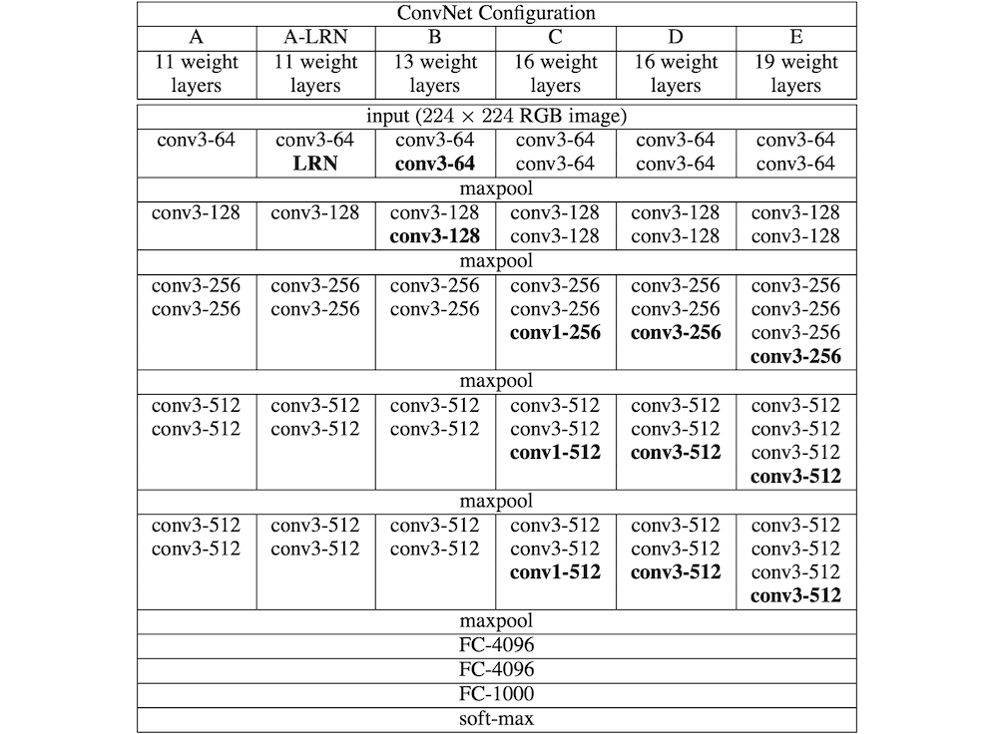

## Taula de continguts
* [Descripcio del projecte](#style-transfer-amb-vgg19)
* [Estructura de VGG19](#1-estructura-de-vgg19)
* [Transferència de l'estil](#2-transferència-de-lestil)
* [*Gram Matrix*](#3-gram-matrix)
  * [Perquè utilitzem la *Gram Matrix*?](#31-perquè-utilitzem-la-gram-matrix)
* [Funció de pèrdues](#4-funció-de-pèrdues)
* [Interfície d'usuari](#5-interfície-dusuari)
* [Codi](#6-codi)
___

# Style Transfer amb VGG19

Aquest projecte consisteix en utilitzar un model VGG19 per a la transferència d'estil entre imatges. Tot això recollit en un programa amb interfície d'usuari.  VGG19 és un model de **xarxa neuronal convolucional** (CNN) desenvolupat per l'equip de Visual Geometry Group de la Universitat d'Oxford i es va presentar al concurs **ILSVRC** ( *ImageNet Large Scale Visual Recognition Challenge* ) de 2014. Aquest model es va endur el 2n premi per darrere de GoogLeNet.  El model ha mostrat molt bons resultats quan s'entrena amb milions d'imatges del dataset **ImageNet**. És molt utilitzat en tasques de visió per computador, com la detecció d'objectes i la **transferència d'estil**.  La transferència d'estil és una tècnica que combina l'estil visual d'una imatge amb el contingut d'una altra imatge, creant una imatge resultant que manté el contingut original però amb l'aspecte estètic de la imatge d'estil.

## 1. Estructura de VGG19

El model pren aquest nom per la seva arquitectura profunda de 19 capes (**16** capes **convolucionals**, **3** capes ***fully-connected***, capes de ***max-pooling*** i funció d'activació **ReLU**). Les capes convolucionals es troben agrupades en 5 blocs convolucionals ( ***fig 1***: *la columna E es correspon amb VGG19* ).  Per al nostre projecte només necessitarem l'etapa d'**extracció de característiques**. Per tant, no hi afegirem les últimes 5 capes (*maxpool*, 3x *fully-connected*, *maxpool*).  Carregarem un conjunt de parametres (***weights***) preentrenats amb el dataset *ImageNet*. A més, congelarem totes les capes per tal d'assegurar-nos que no canviem cap d'aquest parametres ja entrenats.  

  

***fig 1***: *Taula comparativa d'arquitectures de CNNs extreta del paper 'Very Deep Convolutional Networks for Large-Scale Image Recognition' (https://doi.org/10.48550/arXiv.1409.1556)*   

## 2. Transferència de l'estil

Podem utilitzar VGG19 per extreure característiques que ens permetin representar tant l'estil com el contingut d'una imatge: les **capes inicials** de la xarxa capturen detalls d'estil com **textures i colors**, mentre que les **capes més profundes** codifiquen informació de contingut, com ara **objectes i escenes**.  La idea és crear una imatge que anomenem ***target*** que sigui una combinació de dues. Podem iniciar la nova imatge com una copia de la imatge contingut. En el procés de transferència d'estil, **minimitzem les diferències** entre les representacions d'estil de la **imatge *target* i la imatge d'estil**, així com entre les representacions de contingut de la **imatge *target* i l'imatge de contingut**. Aixo ho aconseguim ajustant iterativament la imatge *target* mitjançant ***backprop***. A diferència del que es fa en l'entrament de xarxes neuronals, el *backprop* el realitzem per **modificar el input** (imatge *target*) enlloc dels pesos (*weights*). D'aquesta manera creem una nova imatge que manté el contingut original però pren l'estil de l'altre imatge.
___
## 3. *Gram Matrix*

En els models de transferència d'estil s'acostuma a utilitzar una operació matricial que té com a resultat una matriu que s'anomena ***Matriu Gram***.  Per exemple, si partim d'un conjunt de vectors (diguem $F$) i la seva transposada ($F^T$), la *Matriu Gram* de $F$ seria la multiplicació matricial d'aquestes dues:  $G = F \times F^T$  Aquesta matriu resultant codifica l'autocorrelació del conjunt de vectors $F$. És a dir, és una representació de la **correlació que existeix entre els diferents vectors** del conjunt. Aixó es degut a que cada valor de $G$ és el producte escalar de dos vectors de $F$:  $G_{ij} = F_i \cdot F_j$

### 3.1 Perquè utilitzem la *Gram Matrix*?

Utilitzem aquesta matriu per obtenir una **representació de l'estil i contingut** de cada imatge. Per entendre millor, però, la utilitat d'aquesta representació, cal entendre com l'apliquem en el nostre projecte.  En el context de transferència d'estil, volem calcular una *Matriu Gram* per algunes de capes del model (**una matriu per cadascuna** de les capes seleccionades). Cal recordar que diferents capes captaràn característiques diferents de la imatge: capes **inicials** representeràn **detalls petits** i capes més **profundes** captaràn **característiques més generals**. Per tant, el que farem serà trobar correlacions entre detalls petits de la imatge (**estil**) i també correlacions entre característiques generals (**contingut**).  El conjunt de vectors que anteriorment hem anomenat $F$ seria el conjunt de mapes de característiques  que genera **una sola capa** del model VGG19. Per calcular una de les Matrius Gram ho fariem de la següent manera:
* $F_n$ seria el conjunt de mapes de característiques resultant de la *n-éssima* capa convolucional amb dimensions $(D, H, W)$ on: $D$ = numero de filtres, $(H)$ = alçada del mapa de característiques i $(W)$ = amplada del mapa de característiques.
* Cada mapa de característiques $F_n$ es transforma en un conjunt de vectors (*matriu*) de dimensions $(D, H \times W)$. Podem dir que en aquest procés *estirem* els mapes de característiques generats per cada filtre perque prenguin forma de vector (de tamany $H \times W$).
* A partir d'aquesta matriu $F_n$ calculem la corresponent *Matriu Gram*: $G_n = F_n \times F_n^T$
___
## 4. Funció de pèrdues

___
## 5. Interfície d'Usuari
django? o local?
___
## 6. Codi
